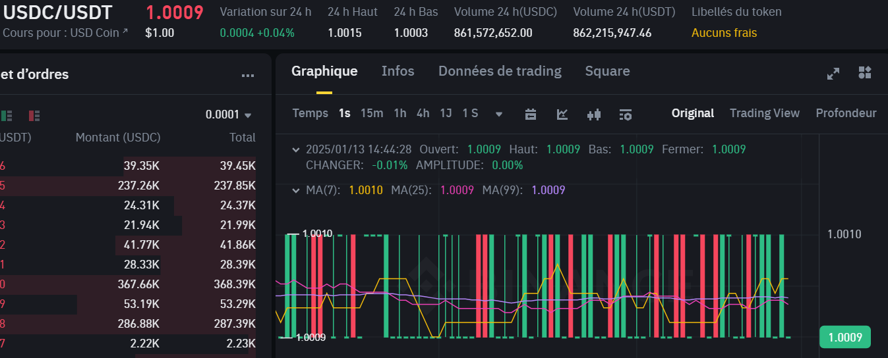

# web scraping Binance trading bot

## Contexte et objectif

Le but de notre programme est de faire du trading à « haute fréquence ». Ici le programme à pour objectif de récupérer le cour d’échange de 2 cryptomonaie toute les secondes, ce qu’un humain ne pourrait pas faire.

Voici un extrait du cour, le but est de prendre une décision à chaque changement du cour pour faire des petits profits mais un grand nombre de fois.

Le challenge de ce projet et d’agir vite, il faut récupérer le cour, calculer notre indicateur, prendre la décision, envoyé un ordre de vente ou d’achat en fonction de cette indicateur.

## L'algorithme
Je vais maintenant décomposer chacune de ces étapes en expliquant nos choix :

### Le cour
On a choisi de récupérer le cour dans le titre de la page plutôt que dans le corps de la page car la class se nomme avec ce schéma : `class="showPrice-css-1d7fiqe"` avec l’identifiant à la suite de `css` qui est dynamique. On se base donc sur le titre qui est de nom fixe et on ne stock que la première partie qui contient le cour actuel (en la repérant grâce aux espaces du titre). Cette méthode est légèrement moins optimisé que de récupérer directement le cour dans le corps de la page car la donnée récupéré demande un traitement supplémentaire.

On utilise une bibliothèque de scraping synchrone pour simplifier le programme, le temps de réponse est de environ `400ms` ce qui nous laisse le temps de traiter les données. Mais pour gagner en régularité et en performance on pourrait utiliser une bibliothèque de scraping asynchrone et ainsi avoir un thread qui se déclenche à intervalle fixe. La difficulté de cette méthode est de gérer une liste ordonné des réponses pour calculer notre indicateur.

### L’indicateur
L’indicateur que nous utilisons est une moyenne du cour des 15 dernières pour estimer le prochain. On va donc stocker le cour dans une liste qui ne fera que 15 éléments pour ensuite faire une moyenne dessus.
Ici nous avons décider de stocker le cour dans une liste plutôt que de récupérer cette information dans le .csv de sorti pour s’épargner le temps de lecture qui serait de plus en plus long avec l’alimentation de ce dernier.

### L’ordre
On a 2 scénarios possible :
+ Si on a pas d’ordre actif, on compare le cour actuel et l’indicateur, on va alors acheter si le cour actuel est inférieur à l’indicateur. On stock le prix d’achat.
+ Si on a un ordre actif, on compare le prix d’achat et le cour, on va alors vendre si le cour est plus haut que notre prix d’achat. On réalise alors nos profits.

### Stockage
On va écrire dans un `.csv` la date, l’heure, le cour, l’indicateur, l’ordre. On a choisi un `.csv` car la manipulation de ce type de format de fichier est natif à java et donc plus rapide à l’exécution.

### Sleep
Au début de la boucle on stock l’heure actuelle, on va ensuite déterminer le temps d’attente grâce au delta à la fin de la boucle. On passe par là plutôt qu’un temps fixe car le délai de réponse du site est variable et la bibliothèque étant synchrone, le programme attend la réponse avant de continuer son exécution. Cette méthode est plus lente et est susceptible de bloquer le programme en cas de site inaccessible contrairement à une bibliothèque asynchrone, mais cette méthode est plus simple à utiliser.
La méthode de calcul induis un léger décalage pour un grand nombre d’itération du programme (par exemple `43 200` itération soit `12h` d’exécution) on se retrouve avec un `10min` d’exécution en trop, une bibliothèque asynchrone résoudrait ce problème.
Le nombre d’itération de la boucle est choisi par l’utilisateur au lancement, il convient donc à l’utilisateur de faire en sorte que le nombre renseigner soit raccord avec son objectif.

## Retour sur le programme
La version actuelle du programme est plutôt simpliste, on profite de la faible quantité de donnée à gérer et de la performance des outils actuelle pour rentrer dans son objectif.
Dans d’autre conditions (plusieurs cour à suivre, possibilité d’échange plus fréquent, connexion lente, indicateur sur une plus grande quantité de données,…) il serait nécessaire d’optimiser ce programme en explorant les réflexions poser au cour de ce dossier.

## Rapport

> Git by Franklin et Titouan
